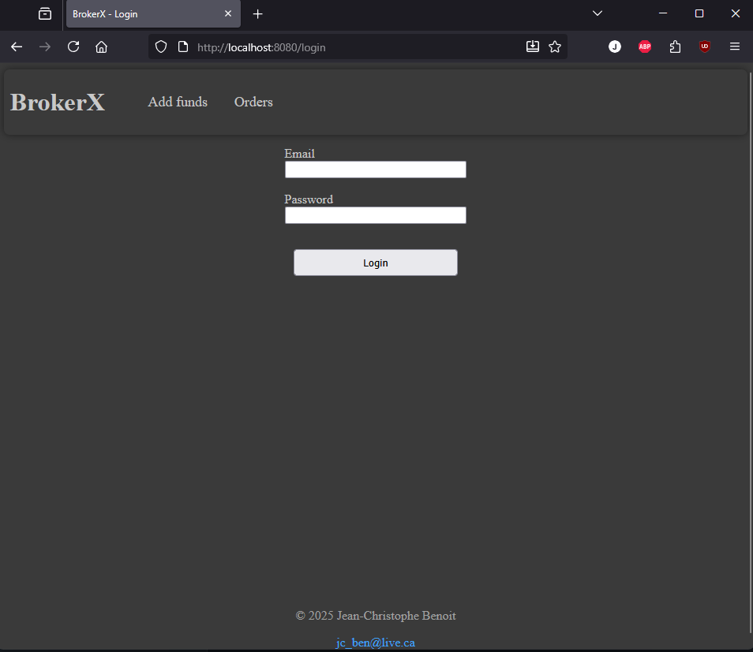
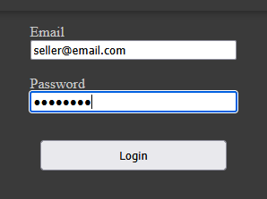
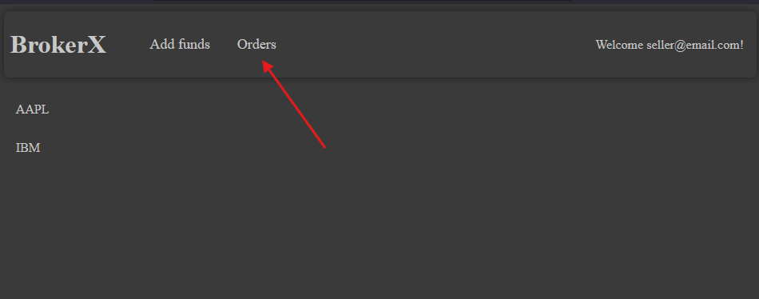
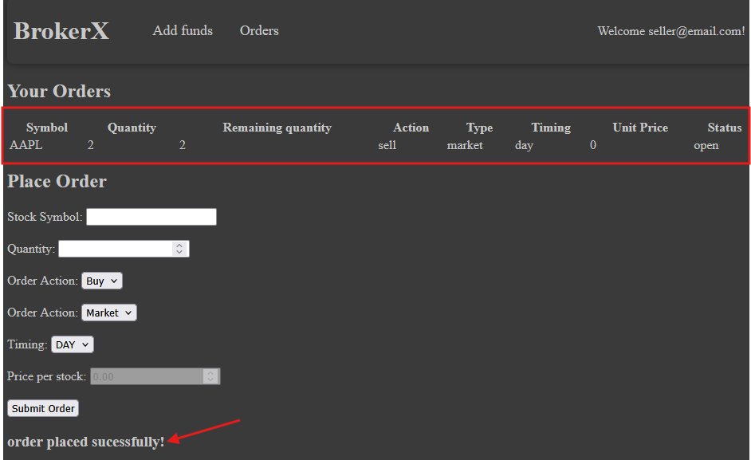
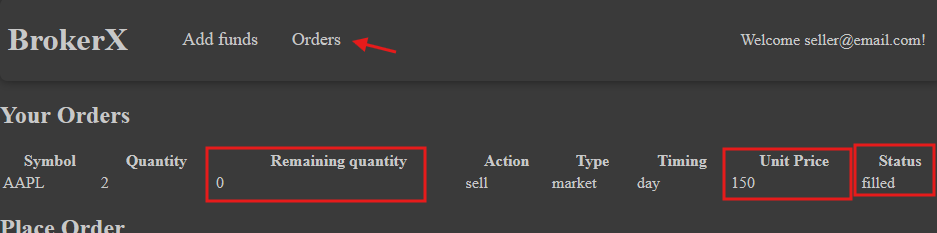

# log430-projet - Runbook

This document show syou how to use BrokerX once it has been deployed either locally or remotely.

## Access BrokerX

To access BrokerX, use your web browser and navigate to :

- Locally : http://localhost:8080/
- Remotely : http://10.194.32.206:8080/

## Logging in

Enter the email and password and click on _Login_ to access the account of a seller :

- Email : seller@email.com
- Password : password

## Placing an order

From the home page, click on _Orders_ :

Then you can fill the form to sell AAPL stocks at market price and click _Submit Order_ :

Then you should see your order appear at the top of the page and this confirmation message at the bottom of the form.

> Error messages will also appear at the bottom of the form.

Next, if you click on _Orders_ again in the navigation bar, you should see that your order status, unit price and remaining quantity have been updated :

That's it for now!

> Other users (email and buyer@email.com) have different base positions, orders and wallet balances, which make for different outputs in results.
