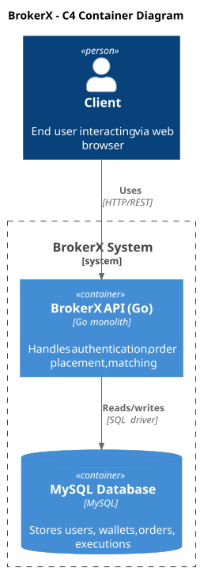
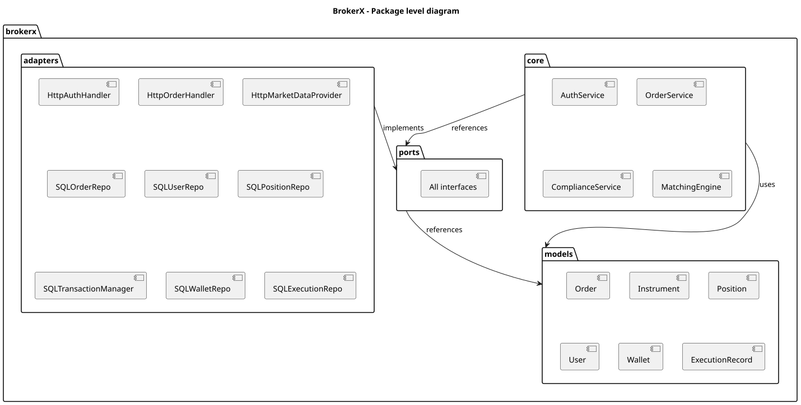

**About arc42**

arc42, the Template for documentation of software and system
architecture.

By Dr. Gernot Starke, Dr. Peter Hruschka and contributors.

Template Revision: 7.0 EN (based on asciidoc), January 2017

© We acknowledge that this document uses material from the arc 42
architecture template, <http://www.arc42.de>. Created by Dr. Peter
Hruschka & Dr. Gernot Starke.

# 1. Introduction and Goals

## 1.1 Requirements Overview

The BrokerX project is an online brokerage platform targeting individual investors, developed in response to the rapidly evolving financial services sector. It is made to allow retail investors to trade stocks securely and rapidly from the comfort of their home.

### The system **must** support the following core functionalities:

- **Authentication** : Secure login with session cookies.
  - Justification: Secure access to the system is mandatory, especially considering the sensitivity of the data residing on BrokerX.
- **Order placement** : Allow users to place market or limit orders on various stocks.
  - Justification: This is a core business function. Without order placement, Brokerx has no reason to exist.
- **Matching & Execution** : Ensure matching of buy and sell orders using an internal matching engine, generating an execution report.
  - Justification: This is another feature that is too important to be ignored, placing an order to buy stocks is a must, but it is not useful if the order cannot be matched with a corresponding selling order.

### The system **should** support the following functionalities:

- **Market data subscription** : Realtime market data updates (top-of-book, trades, OHLC).
  - Justififcation: This feature should definitely be a part of BrokerX, so that users do not have to use another platform to consult stock prices, but it is not a necessity to have a brokerage system that works.
- **Registration** : Account creation and identity verification via an OTP sent by email.
  - Justification: For now, user accounts can be manually added to the system and tests of the whole system can still be done without a registration page.
- **Wallet funding** : Allow users to add money to their BrokerX wallet in order to buy stocks and get compensated for selling stocks.
  - Justification: For now, wallets can be also be manually created and given any amount as a test balance, since the system does not yet interact with the real stock market.
- **Order modification/cancellation** : Allow users to modify or cancel order that have been placed.
  - Justification: This is not a necessity as it does not pose any real risk to lack the ability to modify or cancel orders during this phase. However, a brokerage platform should definitely have this feature in order to rectify input errors.

### The system **could** support the following functionalities:

- **Notifications** : Send email notifications to the user when and order is confirmed.
  - Justification: This is a nice-to-have and in no way necessary to a working brokerage platform.a

> These functions cover the core trading workflow and will be expanded in later iterations.

[LOG430 - 2025.3 - Projet - Cahier de Charge.pdf](Other%20docs/cahier_de_charge.pdf)

## 1.2 Quality Goals

| Priority | Quality goal | Scenario                                                   |
| -------- | ------------ | ---------------------------------------------------------- |
| 1        | Latency      | ≤ 500 ms to get an acknowledgement after placing an order. |
| 2        | Throughput   | ≥ 300 orders successfully placed per second.               |
| 3        | Availability | The system must be available at least 90% of the time.     |

These goals are to be met during the first iteration (monolithic architecture) of BrokerX.

**Notes / roadmap:** The project specification defines phased targets (monolith → microservices → event-driven) where the latency/throughput and availability targets tighten in later phases. Observability (logs + metrics) is required from phase 2 and distributed tracing from phase 3. These constraints drive the choice of architecture and incremental migration plan

## 1.3 Stakeholders

**Contents.**

| Role/Name                     | Contact                | Expectations                                                                                               |
| ----------------------------- | ---------------------- | ---------------------------------------------------------------------------------------------------------- |
| Clients (web users)           | _N/A_                  | Fast, correct order handling; clear execution confirmations; accurate portfolio balances.                  |
| Developers of BrokerX         | Jean-Christophe Benoit | Clear modular code structure (domain vs infra), testability, reproducible CI/CD, containerized deployment. |
| Back-Office Operations        | _N/A_                  | Accurate execution records, trustworthy reports for accounting.                                            |
| Compliance /Risk Employees    | _N/A_                  | Control over pre-trade checks, post-trade surveillance, immutable logs, idempotency guarantees.            |
| External Market Data Provider | _N/A_                  | Well-defined streaming API (subscribe/unsubscribe); order routing contracts for simulated exchanges.       |

\newpage

# 2. Architecture Constraints

| Constraint  | Description                                                                                                                                                                                  |
| ----------- | -------------------------------------------------------------------------------------------------------------------------------------------------------------------------------------------- |
| Technology  | C#, Go, Rus or C++ permitted. Python or JavaScript/TypeScript are strongly discouraged for the backend part of the system.                                                                   |
| Performance | The system must meet latency, throughput and availability targets.                                                                                                                           |
| Deployment  | The system prototype must be containerized and deployed on a public or semi publicly accessible platform via an automatic CI/CD pipeline. Only one artifact must be deployed during phase 1. |

\newpage

# 3. System Scope and Context

## Business Context

## Technical Context

\newpage

# 4. Solution Strategy

| Problem                        | Solution                                                                                                                                                                                                                                                                                      |
| ------------------------------ | --------------------------------------------------------------------------------------------------------------------------------------------------------------------------------------------------------------------------------------------------------------------------------------------- |
| Maintainability and evolution  | Internally, the system code is organized in a modular fashion using an architecture similar to hexagonal. This isolates the domain logic from infrastructure adapters. This allows the monolithic prototype to evolve somewhat easily in later phases.                                        |
| Data consistency and integrity | A MySQL database is used to store all data as the one source of truth. Entities and data queries and commands are managed with repositories which abstract the database specific logic into interfaces. Transactions are used in critical flows like order executions to maintain consistency |
| Delivering data to client      | The Go server supports multiple http endpoints for server rendered html templates and data retrieval.                                                                                                                                                                                         |
| Latency and throughput         | Using the Go language because it is well-suited for high concurrency, low latency environments. Goroutines are easily implementable for asynchronous processing, making order acknowledgement faster.                                                                                         |
| Error Handling & Observability | The Go programming language is made for functions to return multiple return values, making it very easy to propagate errors from any layers back to the client. It also comes with a an integrated logging library, ensuring the system's behaviors and faults are observable at any point.   |

\newpage

# 5. Building Block View

# 6. Runtime View

## General Use Case Diagram

> The use cases colored in green are the ones that are currently implemented in the system

## UC-02 Login

### Goal:

Allow a registered user to securely authenticate into the BrokerX system.

### Actors:

- Primary: Client (user)
- Supporting: MySQL DB

### Preconditions:

- The user is already registered in the system.
- Credentials (email, password hash) are stored in the database.

### Main Flow:

**1.** The Client submits email and password to the system.

**2.** The system receives the credentials and validates them.

**3.** The system returns the home page, along with a signed session cookie to the client

### Postconditions:

- User is authenticated and can call secured endpoints with the cookie.

### Exceptions / Alternatives:

**E2.** Database unavailable → The system returns an error 500 Internal Server Error.

**A3.** Invalid credentials → The system returns an error 401 Unauthorized.

**A3.** Third failed authentication attempt → The system returns an error 401 Unauthorized and locks the account for 30 minutes.

## UC-05 Place order

### Goal:

Allow a user to place a buy or sell order on a stock.

### Actors:

- Primary: Client (user)
- Supporting: Market Data Provider

### Preconditions:

- The user is logged in.
- The Market Data Provider is up and running.
- The client is on the Orders page

### Main Flow:

**1.** The Client completes the form to place an order containing the symbol, quantity, action, type, timing and unit price.

**2.** The system receives the order data and validates that the inputs are not empty.

**3.** The system starts verification the compliance of the order.

**4.** The system requests instrument and price data from the Market Data Provider.

**5.** The Market Data Provider responds with instrument tick size and price band.

**6.** The system finishes verifying the compliance of the order.

**7.** The system creates an order.

**8.** The system submits the order to the internal matching engine.

**9.** The system send an acknowledgement to the client that the order has been placed.

**10.** The client receives the acknowledgement.

### Postconditions:

- The order is stored in the database with open status.
- The client can see the new placed order with all its information.

### Exceptions / Alternatives:

**E3.** The order has an invalid quantity → The system propagates the error back to the client. The order is not created.

**E5.** The Market Data Provider does not respond → The system propagates the error back to the client. The order is not created.

**E5.** The user does not have enough funds → The system propagates the error back to the client. The order is not created.

**E5.** The user does not have enough stocks → The system propagates the error back to the client. The order is not created.

**E5.** The order tick size or price band does not match the instrument's required tick size or price band → The system propagates the error back to the client. The order is not created.

## UC-07 Find match and execute order

Match incoming buy and sell orders and generates execution records.

### Actors:

- Primary: Client (user)
- Supporting: _None_

### Preconditions:

- A valid order was placed by the client and submitted to the internal matching engine

### Main Flow:

**1.** The matching engine receives the order.

**2.** The matching engine fetches all matching orders (symbol, action, type) from the database.

**3.** The matching engine finds a match or multiple matches for the submitted order.

**4.** The matching engine generates execution records for each match order.

**5.** The matching engine updates order(s) quantities and status.

**5.** The matching engine saves the execution records to the database.

### Postconditions:

- The order changes are saved to the database.
- The client can see the submitted order with all its information and the status and quantities updated.
- The client can see each execution record for the order

### Exceptions / Alternatives:

**E2.** There is a database error when fetching the orders → The system logs the error. The order stays in the database. The order is not updated.

**A2.** The systeme finds no match for the order → The order stays in the database. The order is not updated. No execution records are saved.

**E5.** There is a database error when updating the order(s) → The system logs the error. The order stays in the database. The order is not updated. The execution records are not saved.

**E6.** There is a database error when saving the execution records → The system logs the error. The order stays in the database. The order is not updated. The execution records are not saved.

\newpage

# 7. Deployment View

\newpage

# 8. Cross-cutting Concepts

- Architecture semi-hexagonale
- Server-side HTML rendring
- Interfaces
- MySQL relational database
- Repository pattern
- Transaction pattern

\newpage

# 9. Design Decisions

---

## ADR-01: Hexagonal architecture

### Context

BrokerX must be evolvable across phases: from monolithic prototype to micro-services and eventually event-driven. A tightly coupled MVC design would limit flexibility. We need an architecture that clearly separates domain logic from infrastructure to make refactoring manageable.

### Decision

Adopt a hexagonal style architecture (ports and adapters):

- **Core domain layer**: entities, matching engine, business rules
- **Ports**: interfaces for any internal/external service, data access objects
- **Adapters**: implementations of the interfaces (REST API handlers, SQL repositories, mock data provider)

### Status

Accepted

### Consequences

- Domain logic is independent of delivery and persitence mechanisms
- Easier to swap infrastructure (database, APIs) without touching core logic
- Simplifies testing (domain logic can be tested in isolation)
- Slightly higher complexity (more abstractions, interfaces, files)
- May be over engineering for phase 1 but will most likely pay off in later phases

---

## ADR-02: Persistence with MySQL and Repository/Transaction Manager Pattern

### Context

BrokerX must maintain strong consistency for orders, executions and balances. Persistent storage was required by the project and we want to avoid spreading raw SQL queries across the codebase.

### Decision

Use MySQL relational database as the system of record, accessed through repository interfaces in the ports layers. Repositories abstract database-specific logic into adapters. Transactions are applied for critical operations (order matching).

### Status

Accepted

### Consequences

- Centralized persistence logic, easier to maintain
- Enforces data integrity using SQL constraints and transactions
- Repository interfaces decouple domain logic from data access details, allowing easier replacement of persistent storage in the future.
- Less flexibility in schema evolution if requirements change rapidly

---

## ADR-03: Use of Go as Implementation Language

### Context

The backend must support low latency and high throughput for order placement and matching. It must also be portable across environments (developer laptops, CI/CD pipelines, VMs). The following languages were considered :

- Java/C#
- Python/Node.js
- Rust/C

### Decision

Implement BrokerX backend API server in Go (Golang)

### Status

Accepted

### Consequences

- Very fast compilation and deployment cycle.
- Excellent concurrency support for handling many requests/orders.
- Small memory footprint, portable binaries.
- Clean error handling via multiple return values.
- Newer language, meaning lack of libraries in certain domains

\newpage

# 10. Quality Requirements

## Latency

## Throughput

## Data Integrity

## Security

## Testability

## Interoperability

\newpage

# 11. Risks and Technical Debts

- Writing a lot of code in a short amount of time can lead to lack of unit testing and therefore, quality degradation.
- Lack of code review due to the project being individually developped.
- There is a risk of long refactoring time between phases depending on the evolvability of the system.

\newpage

# 12. Glossary

| Term                       | Definition                                                                                                                                         |
| -------------------------- | -------------------------------------------------------------------------------------------------------------------------------------------------- |
| **ADR**                    | Architecture Decision Record: a short document that captures an important architectural choice, its context, and consequences.                     |
| **Broker**                 | An intermediary that executes buy/sell orders on behalf of investors. BrokerX acts as an online broker for retail clients.                         |
| **CI**                     | Continuous Integration: automation of integrating new code into the main branch with quality checks and automated tests.                           |
| **CD**                     | Continuous Deployment: automation of delivering tested code to production environments.                                                            |
| **Execution**              | The successful match of a buy and sell order, resulting in a trade and an execution report.                                                        |
| **Execution Report**       | A message generated by the matching engine that details the outcome of an order execution (price, quantity, time).                                 |
| **Hexagonal Architecture** | Also called Ports and Adapters: an architectural style that separates the domain logic (core) from external systems (DB, UI, APIs).                |
| **Latency**                | The time it takes for a user action (e.g., placing an order) to receive an acknowledgement from the system.                                        |
| **Limit Order**            | An order to buy or sell a stock at a specified price or better.                                                                                    |
| **Market Data Provider**   | External or simulated service that supplies price and instrument data to BrokerX.                                                                  |
| **Market Order**           | An order to buy or sell immediately at the current market price.                                                                                   |
| **Matching Engine**        | The core system component that pairs buy and sell orders and generates execution records.                                                          |
| **Monolith**               | An application built as a single deployable unit. BrokerX phase 1 is implemented as a Go monolith.                                                 |
| **MySQL**                  | Relational database used by BrokerX to persist orders, executions, users, and balances.                                                            |
| **Order**                  | A request placed by a user to buy or sell a stock (can be market or limit, buy or sell, ioc or day).                                               |
| **IOC**                    | Immediate Or Cancel. Refers to the timing of an order that must be immediately fully filled, if not, it must be cancelled                          |
| **DAY**                    | Refers to the timing of an order that is open until the end of the trading day.                                                                    |
| **Order Book**             | The collection of all open buy and sell orders for a given instrument, managed by the matching engine.                                             |
| **Port**                   | Interface in hexagonal architecture that represents an entry/exit point for the core domain logic (e.g., repository interface, service interface). |
| **Adapter**                | Implementation of a port, connecting the domain logic to infrastructure (e.g., SQL repository, HTTP services).                                     |
| **Pre-trade Checks**       | Compliance rules applied before accepting an order (e.g., tick size validation, price bands, sufficient balance/holdings).                         |
| **Session Cookie**         | Small piece of data stored on the client after login, used to authenticate subsequent requests.                                                    |
| **Tick Size**              | The minimum price movement allowed for a given instrument.                                                                                         |
| **Throughput**             | Number of orders the system can successfully handle per second.                                                                                    |
| **Transaction**            | A group of one or more database operations executed as a single unit of work, ensuring atomicity and consistency.                                  |
| **Wallet**                 | Virtual balance associated with a user account, used to fund purchases and receive proceeds from sales.                                            |
