 \
Jean-Christophe Benoit \
Rapport de projet Phase 3 \
LOG430 — Architecture logicielle \
5 décembre 2025, Montréal \
École de technologie supérieure

<!-- TOC start (generated with https://github.com/derlin/bitdowntoc) -->

- [Run book](#run-book)
   * [Prerequisites](#prerequisites)
   * [Installation](#installation)
   * [Running the project](#running-the-project)
      + [Run locally (without Docker)](#run-locally-without-docker)
      + [Run with Docker Compose](#run-with-docker-compose)
   * [Running tests](#running-tests)
      + [Running all tests (with coverage report)](#running-all-tests-with-coverage-report)
      + [Generate HTML coverage report](#generate-html-coverage-report)
   * [Deployment](#deployment)
      + [Deploying locally](#deploying-locally)
      + [Deploying remotely](#deploying-remotely)
- [User Guide](#user-guide)
   * [Access BrokerX](#access-brokerx)
   * [Registering as a new user](#registering-as-a-new-user)
   * [Logging in](#logging-in)
   * [Placing an order](#placing-an-order)
   * [Adding funds to your wallet](#adding-funds-to-your-wallet)
   * [Checking your positions](#checking-your-positions)
- [Arc42](#arc42)
- [1. Introduction and Goals](#1-introduction-and-goals)
   * [1.1 Requirements Overview](#11-requirements-overview)
      + [The system **must** support the following core functionalities:](#the-system-must-support-the-following-core-functionalities)
      + [The system **should** support the following functionalities:](#the-system-should-support-the-following-functionalities)
      + [The system **could** support the following functionalities:](#the-system-could-support-the-following-functionalities)
   * [1.2 Quality Goals](#12-quality-goals)
   * [1.3 Stakeholders](#13-stakeholders)
- [2. Architecture Constraints](#2-architecture-constraints)
- [3. System Scope and Context](#3-system-scope-and-context)
   * [Business Context](#business-context)
   * [Technical Context](#technical-context)
- [4. Solution Strategy](#4-solution-strategy)
- [5. Building Block View](#5-building-block-view)
- [6. Runtime View](#6-runtime-view)
   * [General Use Case Diagram](#general-use-case-diagram)
   * [Order Saga State Transition Diagram](#order-saga-state-transition-diagram)
   * [UC-01 Sign up](#uc-01-sign-up)
      + [Goal:](#goal)
      + [Actors:](#actors)
      + [Preconditions:](#preconditions)
      + [Main Flow:](#main-flow)
      + [Postconditions:](#postconditions)
      + [Exceptions / Alternatives:](#exceptions-alternatives)
   * [UC-02 Login](#uc-02-login)
      + [Goal:](#goal-1)
      + [Actors:](#actors-1)
      + [Preconditions:](#preconditions-1)
      + [Main Flow:](#main-flow-1)
      + [Postconditions:](#postconditions-1)
      + [Exceptions / Alternatives:](#exceptions-alternatives-1)
   * [UC-05 Place order](#uc-05-place-order)
      + [Goal:](#goal-2)
      + [Actors:](#actors-2)
      + [Preconditions:](#preconditions-2)
      + [Main Flow:](#main-flow-2)
      + [Postconditions:](#postconditions-2)
      + [Exceptions / Alternatives:](#exceptions-alternatives-2)
   * [UC-07 Find match and execute order](#uc-07-find-match-and-execute-order)
      + [Actors:](#actors-3)
      + [Preconditions:](#preconditions-3)
      + [Main Flow:](#main-flow-3)
      + [Postconditions:](#postconditions-3)
      + [Exceptions / Alternatives:](#exceptions-alternatives-3)
   * [UC-08 Confirm order and notify](#uc-08-confirm-order-and-notify)
      + [Actors:](#actors-4)
      + [Preconditions:](#preconditions-4)
      + [Main Flow:](#main-flow-4)
      + [Postconditions:](#postconditions-4)
      + [Exceptions / Alternatives:](#exceptions-alternatives-4)
- [7. Deployment View](#7-deployment-view)
- [8. Cross-cutting Concepts](#8-cross-cutting-concepts)
- [9. Design Decisions](#9-design-decisions)
   * [ADR-01: Hexagonal architecture](#adr-01-hexagonal-architecture)
      + [Context](#context)
      + [Decision](#decision)
      + [Status](#status)
      + [Consequences](#consequences)
   * [ADR-02: Persistence with MySQL and Repository/Transaction Manager Pattern](#adr-02-persistence-with-mysql-and-repositorytransaction-manager-pattern)
      + [Context](#context-1)
      + [Decision](#decision-1)
      + [Status](#status-1)
      + [Consequences](#consequences-1)
   * [ADR-03: Use of Go as Implementation Language](#adr-03-use-of-go-as-implementation-language)
      + [Context](#context-2)
      + [Decision](#decision-2)
      + [Status](#status-2)
      + [Consequences](#consequences-2)
   * [ADR-04: NGINX API Gateway](#adr-04-nginx-api-gateway)
      + [Context](#context-3)
      + [Decision](#decision-3)
      + [Status](#status-3)
      + [Consequences](#consequences-3)
   * [ADR-05: Redi-Based Order Book](#adr-05-redi-based-order-book)
      + [Context](#context-4)
      + [Decision](#decision-4)
      + [Status](#status-4)
      + [Consequences](#consequences-4)
   * [ADR-06: Grafana, Loki and Promtail for observability](#adr-06-grafana-loki-and-promtail-for-observability)
      + [Context](#context-5)
      + [Decision](#decision-5)
      + [Status](#status-5)
      + [Consequences](#consequences-5)
   * [ADR-07: Choreographed Saga with Outbox Pattern](#adr-07-choreographed-saga-with-outbox-pattern)
      + [Context](#context-6)
      + [Decision](#decision-6)
      + [Status](#status-6)
      + [Consequences](#consequences-6)
   * [ADR-08: Notification service](#adr-08-notification-service)
      + [Context](#context-7)
      + [Decision](#decision-7)
      + [Status](#status-7)
      + [Consequences](#consequences-7)
- [10. Quality Requirements](#10-quality-requirements)
   * [Latency](#latency)
   * [Throughput](#throughput)
   * [Data Integrity](#data-integrity)
   * [Security](#security)
   * [Testability](#testability)
   * [Interoperability](#interoperability)
- [11. Risks and Technical Debts](#11-risks-and-technical-debts)
- [12. Glossary](#12-glossary)
- [Performance tests results](#performance-tests-results)
   * [Phase 1: Monolithic BrokerX](#phase-1-monolithic-brokerx)
      + [No caching, no load balancing](#no-caching-no-load-balancing)
         - [100 users with peak ~65 orders placed/second](#100-users-with-peak-65-orders-placedsecond)
         - [200 users with peak ~105 orders placed/second](#200-users-with-peak-105-orders-placedsecond)
         - [100 users with peak ~65 orders placed/second](#100-users-with-peak-65-orders-placedsecond-1)
      + [Added Redis Order book (caching), no load balancing](#added-redis-order-book-caching-no-load-balancing)
         - [Load test up to 400 RPS](#load-test-up-to-400-rps)
         - [Performance test result after implementing regular dirty order syncing (7 minutes, 500 users, 5 users/second)](#performance-test-result-after-implementing-regular-dirty-order-syncing-7-minutes-500-users-5-userssecond)
         - [Performance test result after removing unused composite indexes (7 minutes, 500 users, 5 users/second)](#performance-test-result-after-removing-unused-composite-indexes-7-minutes-500-users-5-userssecond)
         - [Performance test result after implementing Redis order persistence queue and execution record persistence queue (7 minutes, 500 users, 5 users/second) :](#performance-test-result-after-implementing-redis-order-persistence-queue-and-execution-record-persistence-queue-7-minutes-500-users-5-userssecond-)
      + [Added load balancing](#added-load-balancing)
         - [Performance test result 2 instances (7 minutes, 500 users, 5 users/second)](#performance-test-result-2-instances-7-minutes-500-users-5-userssecond)
         - [Performance test result 2 instances (10 minutes, 1000 users, 5 users/second)](#performance-test-result-2-instances-10-minutes-1000-users-5-userssecond)
         - [Performance test result 2 instances (10 minutes, 1600 users, 5 users/second)](#performance-test-result-2-instances-10-minutes-1600-users-5-userssecond)
   * [Phase 2 : Micro-services architecture BrokerX](#phase-2-micro-services-architecture-brokerx)
      + [No load balancing](#no-load-balancing)
         - [Run #1 (300 RPS)](#run-1-300-rps)
         - [Run #2 (300 RPS)](#run-2-300-rps)
         - [Run #3 (300 RPS)](#run-3-300-rps)
         - [Run #4 (up to 600 RPS)](#run-4-up-to-600-rps)
         - [Run #5 (up to 900 RPS)](#run-5-up-to-900-rps)
      + [With load balancing](#with-load-balancing)
   * [Phase 3 : Event-driven architecture BrokerX](#phase-3-event-driven-architecture-brokerx)
   * [Load Tests Conclusions](#load-tests-conclusions)

<!-- TOC end -->


<!-- TOC --><a name="run-book"></a>
# Run book
<!-- TOC --><a name="prerequisites"></a>
## Prerequisites

To run this project locally, you need the following tools installed:

- [Go 1.25+](https://go.dev/dl/)
- [Docker](https://docs.docker.com/get-docker/) & [Docker Compose](https://docs.docker.com/compose/)

<!-- TOC --><a name="installation"></a>
## Installation

1. **Clone the repository**

   ```bash
   git clone https://github.com/cjayneb/log430-project.git
   cd log430-project
   ```

2. **Configure environment variables**

   Change the values in the `backend/services/{service-name}/config.go` files if you want to override defaults.
   Example:

   ```env
    Port  string `env:"APP_PORT" envDefault:"8181"`
    DBUrl string `env:"DATABASE_URL" envDefault:"user:pass@tcp(127.0.0.1:3306)/brokerx"`
   ```

   > The variables in `config.go` are used when running the app locally. The environnement variables set in the `docker-compose.yml` will override the values set in `backend/services/{service-name}/config.go` when running the project with Docker Compose.

<!-- TOC --><a name="running-the-project"></a>
## Running the project

<!-- TOC --><a name="run-locally-without-docker"></a>
### Run locally (without Docker)

From on of the `backend/services/{service-name}` directories:

```bash
go run .
```

This will start the microservice's API on http://127.0.0.1:8080.

- Health endpoint: http://127.0.0.1:8080/health (GET) (each microservice has one)

More examples
- Login endpoint: http://127.0.0.1:8080/api/user/auth/login (POST)
- Home page endpoint: http://127.0.0.1:8080/ (GET)
- Orders page endpoint: http://127.0.0.1:8080/api/order (GET)

> You must have a MySQL instance, Redis instance and a Kafka instance running on your machine for all uses cases to work (depends on the service, see C$ container diagram)

<!-- TOC --><a name="run-with-docker-compose"></a>
### Run with Docker Compose

From the project root:

```bash
docker compose down -v # To remove existing containers and their volumes
docker compose up --build -d
```

This starts:

- The Go backend microservices on [http://localhost/api](http://localhost/api)
- A MySQL database (`brokerx_db`) on port `3306`
- Nginx API Gateway
- Redis DB
- Kafka instance
- Promtail, Loki and Grafana instances

<!-- TOC --><a name="running-tests"></a>
## Running tests

**Important** : Before running all tests, you must have the test database up, because some of the tests are integration tests needing a real database.

Run the following command to start the test database:

```bash
#From the root of the project
docker compose -f docker-compose.test.yml up -d
```

<!-- TOC --><a name="running-all-tests-with-coverage-report"></a>
### Running all tests (with coverage report)

Inside the `backend/services/{service-name}` folder of each micro-service:

```bash
go test ./... -coverprofile=coverage
```

<!-- TOC --><a name="generate-html-coverage-report"></a>
### Generate HTML coverage report

```bash
go tool cover -html=coverage
```

<!-- TOC --><a name="deployment"></a>
## Deployment

At this stage, the application is deployed locally or remotely using Docker Compose.
A production-ready deployment would likely use Kubernetes or cloud-based services, but that is outside the current scope.

<!-- TOC --><a name="deploying-locally"></a>
### Deploying locally

To deploy locally, you just have to run the following commands

```bash
docker compose down -v # Ensure Docker is clean with no previous deployment
docker compose up --build -d # Build the Docker image and run docker compose in detached mode
```

<!-- TOC --><a name="deploying-remotely"></a>
### Deploying remotely

The GitHub Actions Workflow should take care of deploying the application to the ETS Virtual Machine self hosted runner automatically on every push. See `.github/workflows/ci_cd.yml`


> To access the remote deployment, you must be connected to the ETS Cisco Secure Client via accesvpn.etsmtl.ca


<!-- TOC --><a name="user-guide"></a>
# User Guide
This document show syou how to use BrokerX once it has been deployed either locally or remotely.

<!-- TOC --><a name="access-brokerx"></a>
## Access BrokerX

To access BrokerX, use your web browser and navigate to :

- Locally : http://localhost/
- Remotely : http://10.194.32.206/

<!-- TOC --><a name="registering-as-a-new-user"></a>
## Registering as a new user

Access the following link in your browser : http://localhost/register.html


Enter you first and last name as well as an email and a password and submit : 


<!-- TOC --><a name="logging-in"></a>
## Logging in

Enter the email and password and click on _Login_ to access the account of a seller :

- Email : seller@email.com
- Password : password


<!-- TOC --><a name="placing-an-order"></a>
## Placing an order

Logging in will bring you to this _Orders_ page:


Then you can fill the form to sell AAPL stocks at market price and click _Submit Order_ :


Then you should see your order appear at the top of the page and this confirmation message at the bottom of the form.

> Error messages will also appear at the bottom of the form.


Next, if you refresh the page, you should see that your order status, and remaining quantity have been updated if a matching order has been found :


> Other users (email and buyer@email.com) have different base positions, orders and wallet balances, which make for different outputs in results.

<!-- TOC --><a name="adding-funds-to-your-wallet"></a>
## Adding funds to your wallet

After logging in, it is possible to add funds to your wallet by clicking on _Wallet_:


Then entering the amount you want to deposit and submitting : 

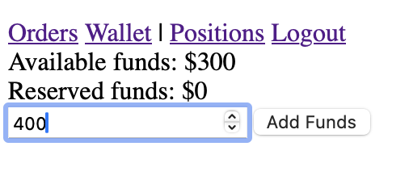

The balances automatically updates themselves and you will be able to make bigger purchases of stocks : 

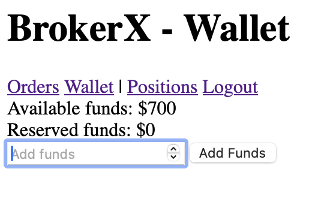

Funds are moved from available to reserved when you make a limit buy order.

<!-- TOC --><a name="checking-your-positions"></a>
## Checking your positions

You can also check your current positions/holdings by clicking on _Positions_ : 

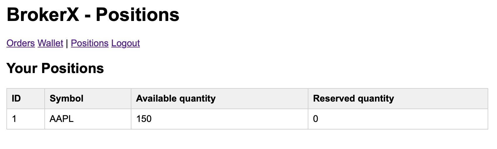

Positions represent the stocks you own and the quantity that is available for new orders and the quantity that is reserved for an open or partifally filled order.


<!-- TOC --><a name="arc42"></a>
# Arc42
<!-- TOC --><a name="1-introduction-and-goals"></a>
# 1. Introduction and Goals

<!-- TOC --><a name="11-requirements-overview"></a>
## 1.1 Requirements Overview

The BrokerX project is an online brokerage platform targeting individual investors, developed in response to the rapidly evolving financial services sector. It is made to allow retail investors to trade stocks securely and rapidly from the comfort of their home.

<!-- TOC --><a name="the-system-must-support-the-following-core-functionalities"></a>
### The system **must** support the following core functionalities:

- **Authentication** : Secure login with session cookies.
  - Justification: Secure access to the system is mandatory, especially considering the sensitivity of the data residing on BrokerX.
- **Order placement** : Allow users to place market or limit orders on various stocks.
  - Justification: This is a core business function. Without order placement, Brokerx has no reason to exist.
- **Matching, Execution & Confirmation** : Ensure matching of buy and sell orders using an internal matching engine, generating an execution report and balancing wallet and position quantities.
  - Justification: This is another feature that is too important to be ignored, placing an order to buy stocks is a must, but it is not useful if the order cannot be matched with a corresponding selling order.

<!-- TOC --><a name="the-system-should-support-the-following-functionalities"></a>
### The system **should** support the following functionalities:

- **Market data subscription** : Realtime market data updates (top-of-book, trades, OHLC).
  - Justififcation: This feature should definitely be a part of BrokerX, so that users do not have to use another platform to consult stock prices, but it is not a necessity to have a brokerage system that works.
- **Registration** : Account creation and identity verification via an OTP sent by email.
  - Justification: For now, user accounts can be manually added to the system and tests of the whole system can still be done without a registration page.
- **Wallet funding** : Allow users to add money to their BrokerX wallet in order to buy stocks and get compensated for selling stocks.
  - Justification: For now, wallets can be also be manually created and given any amount as a test balance, since the system does not yet interact with the real stock market.
- **Order modification/cancellation** : Allow users to modify or cancel order that have been placed.
  - Justification: This is not a necessity as it does not pose any real risk to lack the ability to modify or cancel orders during this phase. However, a brokerage platform should definitely have this feature in order to rectify input errors.

<!-- TOC --><a name="the-system-could-support-the-following-functionalities"></a>
### The system **could** support the following functionalities:

- **Notifications** : Send email notifications to the user when an event happens for a given order.
  - Justification: This is a nice-to-have and in no way necessary to a working brokerage platform.a

> These functions cover the core trading workflow and will be expanded in later iterations.

[LOG430 - 2025.3 - Projet - Cahier de Charge.pdf](Other%20docs/cahier_de_charge.pdf)

<!-- TOC --><a name="12-quality-goals"></a>
## 1.2 Quality Goals

| Priority | Quality goal | Scenario                                                   |
| -------- | ------------ | ---------------------------------------------------------- |
| 1        | Latency      | ≤ 100 ms to get an acknowledgement after placing an order. |
| 2        | Throughput   | ≥ 1000 orders successfully placed per second.               |
| 3        | Availability | The system must be available at least 99.9% of the time.     |

These goals are to be met during the third iteration (event-driven architecture) of BrokerX.

**Notes / roadmap:** The project specification defines phased targets (monolith → microservices → event-driven) where the latency/throughput and availability targets tighten in later phases. Observability (logs + metrics) is required from phase 2 and distributed tracing from phase 3. These constraints drive the choice of architecture and incremental migration plan

<!-- TOC --><a name="13-stakeholders"></a>
## 1.3 Stakeholders

**Contents.**

| Role/Name                     | Contact                | Expectations                                                                                               |
| ----------------------------- | ---------------------- | ---------------------------------------------------------------------------------------------------------- |
| Clients (web users)           | _N/A_                  | Fast, correct order handling; clear execution confirmations; accurate portfolio balances.                  |
| Developers of BrokerX         | Jean-Christophe Benoit | Clear modular code structure (domain vs infra), testability, reproducible CI/CD, containerized deployment. |
| Back-Office Operations        | _N/A_                  | Accurate execution records, trustworthy reports for accounting.                                            |
| Compliance /Risk Employees    | _N/A_                  | Control over pre-trade checks, post-trade surveillance, immutable logs, idempotency guarantees.            |
| External Market Data Provider | _N/A_                  | Well-defined streaming API (subscribe/unsubscribe); order routing contracts for simulated exchanges.       |


<!-- TOC --><a name="2-architecture-constraints"></a>
# 2. Architecture Constraints

| Constraint  | Description                                                                                                                                                                                  |
| ----------- | -------------------------------------------------------------------------------------------------------------------------------------------------------------------------------------------- |
| Technology  | C#, Go, Rus or C++ permitted. Python or JavaScript/TypeScript are strongly discouraged for the backend part of the system.                                                                   |
| Performance | The system must meet latency, throughput and availability targets.                                                                                                                           |
| Deployment  | The system prototype must be containerized and deployed on a public or semi publicly accessible platform via an automatic CI/CD pipeline. Multiple artifacts must be deployed during phase 2. The deployed instances must be horizontally scalable (stateless services). |


<!-- TOC --><a name="3-system-scope-and-context"></a>
# 3. System Scope and Context

<!-- TOC --><a name="business-context"></a>
## Business Context


<!-- TOC --><a name="technical-context"></a>
## Technical Context

<!-- TOC --><a name="4-solution-strategy"></a>
# 4. Solution Strategy

| Problem                        | Solution                                                                                                                                                                                                                                                                                      |
| ------------------------------ | --------------------------------------------------------------------------------------------------------------------------------------------------------------------------------------------------------------------------------------------------------------------------------------------- |
| Maintainability and evolution  | Internally, the system code is organized in a modular fashion using an architecture similar to hexagonal. This isolates the domain logic from infrastructure adapters. This allows the monolithic prototype to evolve somewhat easily in later phases.                                        |
| Data consistency and integrity | A MySQL database is used to store all data and acts as a persistent ledger. Entities and data queries and commands are managed with repositories which abstract the database specific logic into interfaces. Transactions are used in critical flows like order executions to maintain consistency. A Redis sorted set acts as a live order book. Kafka topics are used to send and consume events for each service. The system use the choreographed Saga pattern along with Outbox to prevent data losses in case of a crash. |
| Delivering data to client      | The Go server supports multiple http endpoints for server rendered html templates and data retrieval. The frontend code can query these endpoints freely to get the desired data.                                                                                                                                                                                       |
| Latency and throughput         | Using the Go language because it is well-suited for high concurrency, low latency environments. Goroutines are easily implementable for asynchronous processing like the outbox event dispatcher or the event consumers. Kafka is used to produce events, such as the OrderCreated event which is created as soon as an order is placed, making order acknowledgement faster.                                                                                         |
| Error Handling & Observability | The Go programming language is made for functions to return multiple return values, making it very easy to propagate errors from any layers back to the client. It also comes with a an integrated logging library, ensuring the system's behaviors and faults are observable at any point. Using the slog library along with the Go Context, a TraceID and the exact logging line can be found in each log, making it easy to know which request had which effect on the system. |


<!-- TOC --><a name="5-building-block-view"></a>
# 5. Building Block View


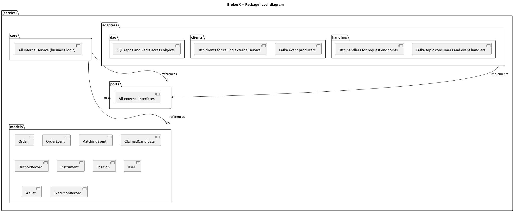

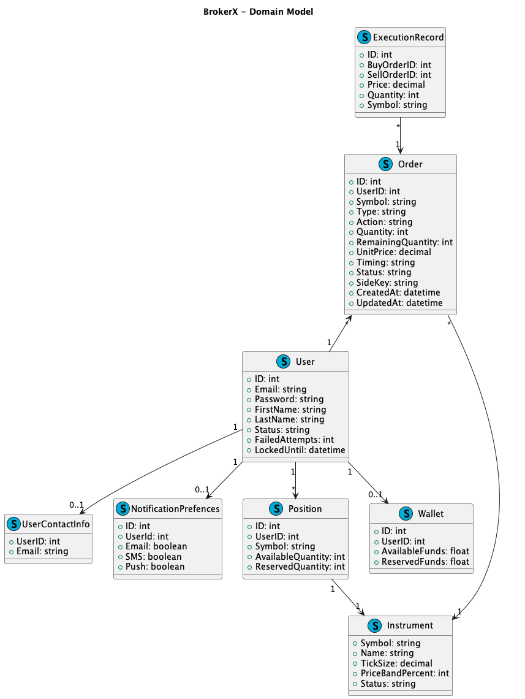

<!-- TOC --><a name="6-runtime-view"></a>
# 6. Runtime View

<!-- TOC --><a name="general-use-case-diagram"></a>
## General Use Case Diagram

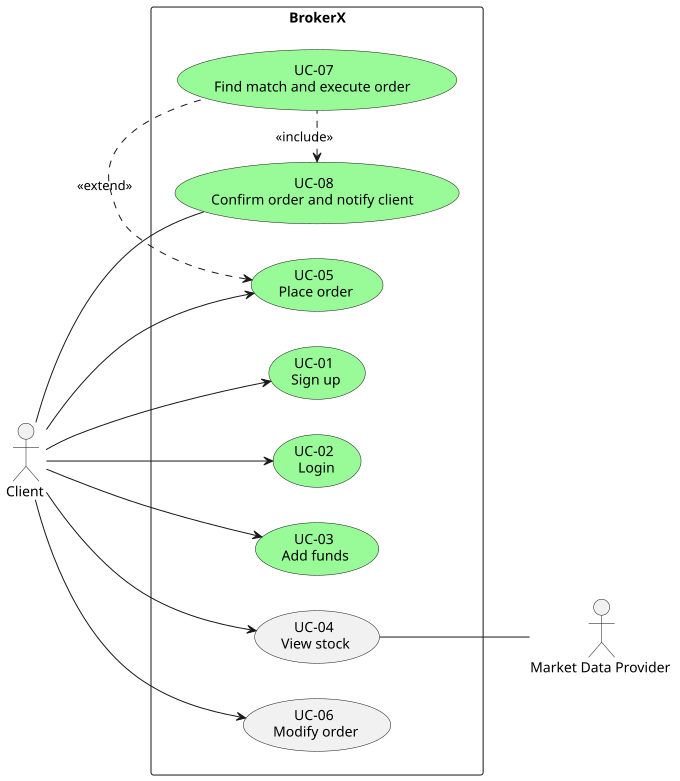

> The use cases colored in green are the ones that are currently implemented in the system

<!-- TOC --><a name="order-saga-state-transition-diagram"></a>
## Order Saga State Transition Diagram

[UC-05 Place Order](#uc-05-place-order), [UC-07 Find match and execute order](#uc-07-find-match-and-execute-order) and [UC-08 Confirm order and notify](#uc-08-confirm-order-and-notify) all follow this state transition diagram :

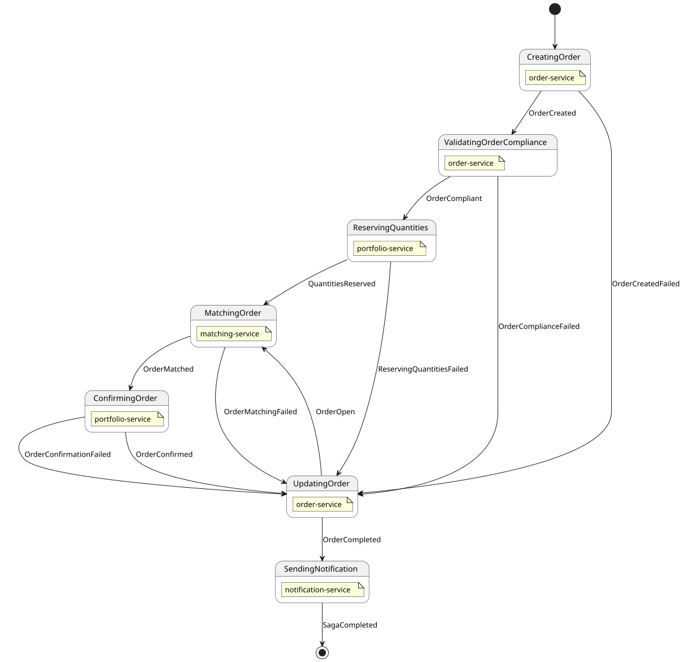

<!-- TOC --><a name="uc-01-sign-up"></a>
## UC-01 Sign up

<!-- TOC --><a name="goal"></a>
### Goal:

Allow a registered user to create a user account so that they can later authenticate to BrokerX and use it.

<!-- TOC --><a name="actors"></a>
### Actors:

- Primary: Client (user)
- Supporting: MySQL DB

<!-- TOC --><a name="preconditions"></a>
### Preconditions:
N.A.

<!-- TOC --><a name="main-flow"></a>
### Main Flow:

**1.** The Client submits email, password, first name and last name to the system.

**2.** The system receives the credentials, validates them and creates a new user in the database.

**3.** The system returns a confirmation of the user registration to the user.

<!-- TOC --><a name="postconditions"></a>
### Postconditions:

- User account is created is the system

<!-- TOC --><a name="exceptions-alternatives"></a>
### Exceptions / Alternatives:

**E2.** Database unavailable → The system returns an error 500 Internal Server Error.

**A1.1** User id header not present in request → The system returns an error 401 Unauthorized.

**A1.2** Invalid credentials (wrong JSON formatting) → The system returns an error 400 Bad Request.

**A2.** User account with given email already exists → The system returns an error 409

<!-- TOC --><a name="uc-02-login"></a>
## UC-02 Login

<!-- TOC --><a name="goal-1"></a>
### Goal:

Allow a registered user to securely authenticate into the BrokerX system.

<!-- TOC --><a name="actors-1"></a>
### Actors:

- Primary: Client (user)
- Supporting: MySQL DB

<!-- TOC --><a name="preconditions-1"></a>
### Preconditions:

- The user is already registered in the system.
- Credentials (email, password hash) are stored in the database.

<!-- TOC --><a name="main-flow-1"></a>
### Main Flow:

**1.** The Client submits email and password to the system.

**2.** The system receives the credentials and validates them.

**3.** The system returns the home page, along with a signed session cookie to the client

<!-- TOC --><a name="postconditions-1"></a>
### Postconditions:

- User is authenticated and can call secured endpoints with the cookie.

<!-- TOC --><a name="exceptions-alternatives-1"></a>
### Exceptions / Alternatives:

**E2.** Database unavailable → The system returns an error 500 Internal Server Error.

**A3.** Invalid credentials → The system returns an error 401 Unauthorized.

**A3.** Third failed authentication attempt → The system returns an error 401 Unauthorized and locks the account for 30 minutes.


<!-- TOC --><a name="uc-05-place-order"></a>
## UC-05 Place order

<!-- TOC --><a name="goal-2"></a>
### Goal:

Allow a user to place a buy or sell order on a stock.

<!-- TOC --><a name="actors-2"></a>
### Actors:

- Primary: Client (user)
- Supporting: Market Data Provider

<!-- TOC --><a name="preconditions-2"></a>
### Preconditions:

- The user is logged in.
- The Market Data Provider is up and running.
- The client is on the Orders page

<!-- TOC --><a name="main-flow-2"></a>
### Main Flow:

**1.** The Client completes the form to place an order containing the symbol, quantity, action, type, timing and unit price.

**2.** The system receives the order data and validates that the inputs are not empty.

**3.** The system creates an order.

**4.** The system submits an OrderCreated event which will be consumed by an internal service.

**5.** The system send an acknowledgement to the client that the order has been placed.

**6.** The client receives the acknowledgement.

<!-- TOC --><a name="postconditions-2"></a>
### Postconditions:

- The order is stored in the database with open status.
- The client can see the new placed order with all its information.

<!-- TOC --><a name="exceptions-alternatives-2"></a>
### Exceptions / Alternatives:

**E2.** The order has an invalid inputs → The system propagates the error back to the client. The order is not created.

**E3.** There is an error when creating the order → The system propagates the error back to the client. The order is not created.

**E4.** There is an error submitting the event → The system propagates the error back to the client. The order is not created.

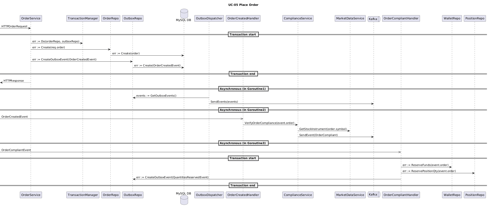

<!-- TOC --><a name="uc-07-find-match-and-execute-order"></a>
## UC-07 Find match and execute order

Match incoming buy and sell orders and generates execution records.

<!-- TOC --><a name="actors-3"></a>
### Actors:

- Primary: Client (user)
- Supporting: _None_

<!-- TOC --><a name="preconditions-3"></a>
### Preconditions:

- A valid order was placed by the client and submitted to the internal matching engine

<!-- TOC --><a name="main-flow-3"></a>
### Main Flow:

**1.** The matching engine receives the order.

**2.** The matching engine fetches all matching orders (symbol, action, type) from the cache.

**3.** The matching engine finds a match or multiple matches for the submitted order.

**4.** The matching engine submits an OrderMatched event.

<!-- TOC --><a name="postconditions-3"></a>
### Postconditions:


<!-- TOC --><a name="exceptions-alternatives-3"></a>
### Exceptions / Alternatives:

**E2.** There is a database error when fetching the orders → The system logs the error. A OrderMatchingFailed event is submitted.

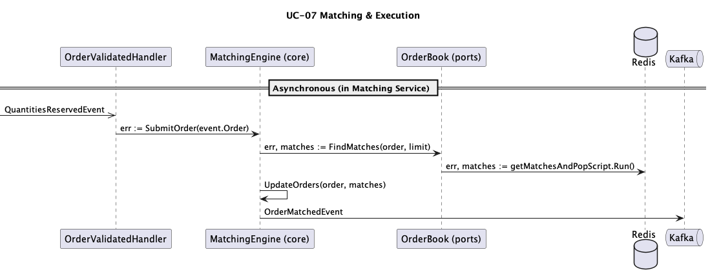

<!-- TOC --><a name="uc-08-confirm-order-and-notify"></a>
## UC-08 Confirm order and notify

Update an incoming order and all its claimed candidates's respective user wallets and positions and send an email notification to the users.

<!-- TOC --><a name="actors-4"></a>
### Actors:

- Primary: Client (user)
- Supporting: _None_

<!-- TOC --><a name="preconditions-4"></a>
### Preconditions:

<!-- TOC --><a name="main-flow-4"></a>
### Main Flow:


<!-- TOC --><a name="postconditions-4"></a>
### Postconditions:


<!-- TOC --><a name="exceptions-alternatives-4"></a>
### Exceptions / Alternatives:


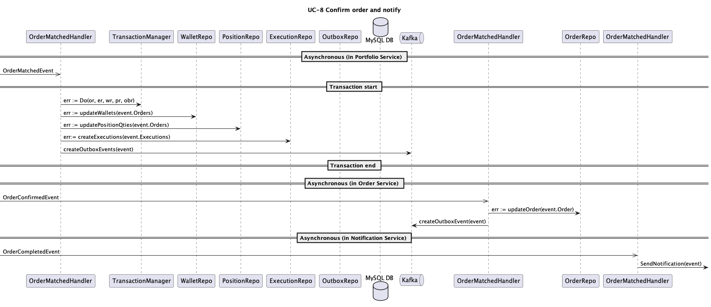


<!-- TOC --><a name="7-deployment-view"></a>
# 7. Deployment View

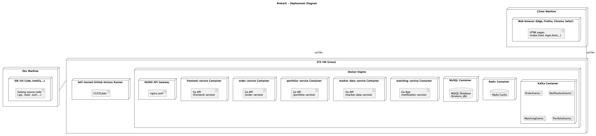


<!-- TOC --><a name="8-cross-cutting-concepts"></a>
# 8. Cross-cutting Concepts

- Quasi-hexagonal Architecture
- Micro-services
- Event-Driven Architecture
- Server-side HTML rendring
- Interfaces
- MySQL relational database
- Redis Cache
- Kafka Event Broker
- Repository pattern
- Transaction pattern
- Choreographed Saga with Outbox pattern


<!-- TOC --><a name="9-design-decisions"></a>
# 9. Design Decisions
---

<!-- TOC --><a name="adr-01-hexagonal-architecture"></a>
## ADR-01: Hexagonal architecture

<!-- TOC --><a name="context"></a>
### Context

BrokerX must be evolvable across phases: from monolithic prototype to micro-services and eventually event-driven. A tightly coupled MVC design would limit flexibility. We need an architecture that clearly separates domain logic from infrastructure to make refactoring manageable.

<!-- TOC --><a name="decision"></a>
### Decision

Adopt a hexagonal style architecture (ports and adapters):

- **Core domain layer**: entities, matching engine, business rules
- **Ports**: interfaces for any internal/external service, data access objects
- **Adapters**: implementations of the interfaces (REST API handlers, SQL repositories, mock data provider)

<!-- TOC --><a name="status"></a>
### Status

Accepted

<!-- TOC --><a name="consequences"></a>
### Consequences

- Domain logic is independent of delivery and persitence mechanisms
- Easier to swap infrastructure (database, APIs) without touching core logic
- Simplifies testing (domain logic can be tested in isolation)
- Slightly higher complexity (more abstractions, interfaces, files)
- May be over engineering for phase 1 but will most likely pay off in later phases

---

<!-- TOC --><a name="adr-02-persistence-with-mysql-and-repositorytransaction-manager-pattern"></a>
## ADR-02: Persistence with MySQL and Repository/Transaction Manager Pattern

<!-- TOC --><a name="context-1"></a>
### Context

BrokerX must maintain strong consistency for orders, executions and balances. Persistent storage was required by the project and we want to avoid spreading raw SQL queries across the codebase.

<!-- TOC --><a name="decision-1"></a>
### Decision

Use MySQL relational database as the system of record, accessed through repository interfaces in the ports layers. Repositories abstract database-specific logic into adapters. Transactions are applied for critical operations (order matching).

<!-- TOC --><a name="status-1"></a>
### Status

Accepted

<!-- TOC --><a name="consequences-1"></a>
### Consequences

- Centralized persistence logic, easier to maintain
- Enforces data integrity using SQL constraints and transactions
- Repository interfaces decouple domain logic from data access details, allowing easier replacement of persistent storage in the future.
- Less flexibility in schema evolution if requirements change rapidly

---

<!-- TOC --><a name="adr-03-use-of-go-as-implementation-language"></a>
## ADR-03: Use of Go as Implementation Language

<!-- TOC --><a name="context-2"></a>
### Context

The backend must support low latency and high throughput for order placement and matching. It must also be portable across environments (developer laptops, CI/CD pipelines, VMs). The following languages were considered :

- Java/C#
- Python/Node.js
- Rust/C

<!-- TOC --><a name="decision-2"></a>
### Decision

Implement BrokerX backend API server in Go (Golang)

<!-- TOC --><a name="status-2"></a>
### Status

Accepted

<!-- TOC --><a name="consequences-2"></a>
### Consequences

- Very fast compilation and deployment cycle.
- Excellent concurrency support for handling many requests/orders.
- Small memory footprint, portable binaries.
- Clean error handling via multiple return values.
- Newer language, meaning lack of libraries in certain domains


<!-- TOC --><a name="adr-04-nginx-api-gateway"></a>
## ADR-04: NGINX API Gateway

<!-- TOC --><a name="context-3"></a>
### Context
We needed a way to easily guard and route external requests to the system.

<!-- TOC --><a name="decision-3"></a>
### Decision

Implement API Gateway with NGINX config file.

<!-- TOC --><a name="status-3"></a>
### Status

Accepted

<!-- TOC --><a name="consequences-3"></a>
### Consequences
- All external requests go through an automated authentication request to the user service before entering the rest of the system, making us able to trust resulting internal requests after that point.
- All API Gateway logic is limited to a single configuration file, making it easy to make changes to the gateway.
- NGINX allows for load balancing requests to the instance with the least amount of traffic, resulting in easy horizontal scaling for the internal services.

<!-- TOC --><a name="adr-05-redi-based-order-book"></a>
## ADR-05: Redi-Based Order Book

<!-- TOC --><a name="context-4"></a>
### Context
During the evolution of the project, we found that the bottleneck of the system under load was the MySQL database. Therefore, we needed a way to lower the load on the database onto another component that allows for faster read and writes.

<!-- TOC --><a name="decision-4"></a>
### Decision

Implement Order Book using Redis Sorted Set and store open and partially filed orders temporarily in the Redis cache.

<!-- TOC --><a name="status-4"></a>
### Status

Accepted

<!-- TOC --><a name="consequences-4"></a>
### Consequences
- The system is able to handle a much higher load because access to data is fast and part of the work is offloaded to the redis cache instaed of the database.
- Added complexity for having atomic behavior. Lua scripts were used to ensure this.
- Cache was momentarily used to store queues of orders and executions to persist but as we move to event driven architecture, the cache is not used for these purposes.


<!-- TOC --><a name="adr-06-grafana-loki-and-promtail-for-observability"></a>
## ADR-06: Grafana, Loki and Promtail for observability

<!-- TOC --><a name="context-5"></a>
### Context
We need a way to collect the logs from each component of our system, store it and make requests on the log contents to get meaningful information about the state of each service.

<!-- TOC --><a name="decision-5"></a>
### Decision

Use Grafana in conjonction with Promtail and Loki for logs.

<!-- TOC --><a name="status-5"></a>
### Status

Accepted (Contested)

<!-- TOC --><a name="consequences-5"></a>
### Consequences
- This ADR is marked as _Contested_ because it has been brought to my attention that Promtail has been deprecated since February 2025 (https://grafana.com/docs/loki/latest/send-data/promtail/). Not enough extensive research had been done before implementing Promtail into the system.
- Promtail works for our current needs but it is good practice to stay up to date and migrate to Alloy in the near future.

<!-- TOC --><a name="adr-07-choreographed-saga-with-outbox-pattern"></a>
## ADR-07: Choreographed Saga with Outbox Pattern

<!-- TOC --><a name="context-6"></a>
### Context
Since the move to event driven architecture was required by the project, we needed to find a way to have distributed transactions when placing orders while ensuring that the data is eventually consistent and correct. The decision also needed to allow for microservices to stay in their bounded context.

<!-- TOC --><a name="decision-6"></a>
### Decision

Use a choreographed Saga Outbox pattern with MySQL and Kafka.

<!-- TOC --><a name="status-6"></a>
### Status

Accepted

<!-- TOC --><a name="consequences-6"></a>
### Consequences
- Added complexity for dealing with errors. Retries are not inate with kafka consumers. The current implementation still does not take care of lost messages properly.
- Most operations must be made idempotent to allow for retries without creating duplicate records
- Decoupling of services through the event broker.
- Permits order service to respond with order acknowledgement faster than before because validation, matching and confirmation are asynchronous.


<!-- TOC --><a name="adr-08-notification-service"></a>
## ADR-08: Notification service

<!-- TOC --><a name="context-7"></a>
### Context
The system must send notifications to the user for registration, login and order events.

<!-- TOC --><a name="decision-7"></a>
### Decision

Create a Notification service that uses Resend for sending emails.

<!-- TOC --><a name="status-7"></a>
### Status

Accepted

<!-- TOC --><a name="consequences-7"></a>
### Consequences
- Resend is very developer friendly and works out of the box.
- The team's domain is already managed by Vercel making it very easy to send emails.
- The service addition is transparent for the rest of the system. No changes needed, because the service consumes events that already exist.
- The notification service is easily extensible for sending other types of notifications in the future such as SMS or push thanks to the NotificationPreferences table.

<!-- TOC --><a name="10-quality-requirements"></a>
# 10. Quality Requirements

<!-- TOC --><a name="latency"></a>
## Latency

- On average, the system must respond to order submissions under 100 ms.
  - Under load, this has been achieved in phase 1 and phase 2 of the project.
  - For phase 3, load test could not be executed due to lack of time, but we expect the system to be stable thanks to asynchronous processing of most requests.
- On the other hand, the latency for receiving the most up to date status of an order will and can vary as long as it is eventually given to the user. 

<!-- TOC --><a name="throughput"></a>
## Throughput
- The system must be able to handle over 1000 order requests per second.
  - This was achieved during phase 1 and 2, phase 3 is pending load test execution.


<!-- TOC --><a name="data-integrity"></a>
## Data Integrity
- The system must ensure that order statuses, position quantities and wallet funds are eventually correct and valid. This is critical in BrokerX because we cannot allow user's money or stock holdings to be lost.
  - The current system guarantees that no funds or positions will be misplaced, but it does not yet ensure that all orders can be processed automatically. In the case of an unexpected error, manual work may be required.

<!-- TOC --><a name="security"></a>
## Security
The current system does not use multi-factor authentication. It is something that will be added in the future.

<!-- TOC --><a name="testability"></a>
## Testability
The current system lacks tests. The justification for this was a lack of time and return on investment for the educational context. With the architecture of the system evolving so fast, all types of tests were hard to maintain. In the future, unit tests, integration tests and end to end tests must be reintegrated.

<!-- TOC --><a name="interoperability"></a>
## Interoperability
The system uses interface and a message broker to communicate between components. Sent events can easily be modified to match the consumer's needs.

<!-- TOC --><a name="11-risks-and-technical-debts"></a>
# 11. Risks and Technical Debts

- Writing a lot of code in a short amount of time can lead to lack of unit testing and therefore, quality degradation.
- Lack of code review due to the project being individually developped.
- There is a risk of long refactoring time between phases depending on the evolvability of the system.
- Promtail, a deprecated service, was implemented into the system due to lack of research, causing technical debt since it will need to be replaced.
- Lack of physical infrastructure to push the limits of horizontal scaling for performance testing.


<!-- TOC --><a name="12-glossary"></a>
# 12. Glossary

| Term                       | Definition                                                                                                                                         |
| -------------------------- | -------------------------------------------------------------------------------------------------------------------------------------------------- |
| **ADR**                    | Architecture Decision Record: a short document that captures an important architectural choice, its context, and consequences.                     |
| **Broker**                 | An intermediary that executes buy/sell orders on behalf of investors. BrokerX acts as an online broker for retail clients.                         |
| **CI**                     | Continuous Integration: automation of integrating new code into the main branch with quality checks and automated tests.                           |
| **CD**                     | Continuous Deployment: automation of delivering tested code to production environments.                                                            |
| **Execution**              | The successful match of a buy and sell order, resulting in a trade and an execution report.                                                        |
| **Execution Report**       | A message generated by the matching engine that details the outcome of an order execution (price, quantity, time).                                 |
| **Hexagonal Architecture** | Also called Ports and Adapters: an architectural style that separates the domain logic (core) from external systems (DB, UI, APIs).                |
| **Latency**                | The time it takes for a user action (e.g., placing an order) to receive an acknowledgement from the system.                                        |
| **Limit Order**            | An order to buy or sell a stock at a specified price or better.                                                                                    |
| **Market Data Provider**   | External or simulated service that supplies price and instrument data to BrokerX.                                                                  |
| **Market Order**           | An order to buy or sell immediately at the current market price.                                                                                   |
| **Matching Engine**        | The core system component that pairs buy and sell orders and generates execution records.                                                          |
| **Monolith**               | An application built as a single deployable unit. BrokerX phase 1 is implemented as a Go monolith.                                                 |
| **MySQL**                  | Relational database used by BrokerX to persist orders, executions, users, and balances.                                                            |
| **Order**                  | A request placed by a user to buy or sell a stock (can be market or limit, buy or sell, ioc or day).                                               |
| **IOC**                    | Immediate Or Cancel. Refers to the timing of an order that must be immediately fully filled, if not, it must be cancelled                          |
| **DAY**                    | Refers to the timing of an order that is open until the end of the trading day.                                                                    |
| **Order Book**             | The collection of all open buy and sell orders for a given instrument, managed by the matching engine.                                             |
| **Port**                   | Interface in hexagonal architecture that represents an entry/exit point for the core domain logic (e.g., repository interface, service interface). |
| **Adapter**                | Implementation of a port, connecting the domain logic to infrastructure (e.g., SQL repository, HTTP services).                                     |
| **Pre-trade Checks**       | Compliance rules applied before accepting an order (e.g., tick size validation, price bands, sufficient balance/holdings).                         |
| **Session Cookie**         | Small piece of data stored on the client after login, used to authenticate subsequent requests.                                                    |
| **Tick Size**              | The minimum price movement allowed for a given instrument.                                                                                         |
| **Throughput**             | Number of orders the system can successfully handle per second.                                                                                    |
| **Transaction**            | A group of one or more database operations executed as a single unit of work, ensuring atomicity and consistency.                                  |
| **Wallet**                 | Virtual balance associated with a user account, used to fund purchases and receive proceeds from sales.                                            |


<!-- TOC --><a name="performance-tests-results"></a>
# Performance tests results
During the second phase of the Brokerx project, a myriad of load tests were done to assess the throughput, latency and availability of the app depending on the architecture and configuration. A Locust container was used to send send requests to the BrokerX endpoint responsible for processing orders.

Here are the test results in chronological order with a description of the improvements made at each iteration.

<!-- TOC --><a name="phase-1-monolithic-brokerx"></a>
## Phase 1: Monolithic BrokerX

<!-- TOC --><a name="no-caching-no-load-balancing"></a>
### No caching, no load balancing
<!-- TOC --><a name="100-users-with-peak-65-orders-placedsecond"></a>
#### 100 users with peak ~65 orders placed/second


Stays usable to whole time, but a slight increase in latency is observed over time.

<!-- TOC --><a name="200-users-with-peak-105-orders-placedsecond"></a>
#### 200 users with peak ~105 orders placed/second


Quickly becomes unusable after reaching 100 RPS due to latency surpassing 500 ms and degrading over time.

> The performance tests above revealed the following issues which will be fixed in the next iterations :
>- One goroutine created per request to submit to matching engine (adressed in Introduce caching #5)
>- Requests to fetch orders every time an order is placed (adressed in Introduce caching #5)
>- Heavy load on CPU caused by html template rendering for every single request (adressed in Transform into RESTful API #1)
>- Lack of Db connection pool management (connections not closing, not being reused) (adressed in Introduce caching #5)
>- Heavy logging (adressed in Structure logs #7)


<!-- TOC --><a name="100-users-with-peak-65-orders-placedsecond-1"></a>
#### 100 users with peak ~65 orders placed/second

The main culprit was found to be the html rendering for every single request. After removing html rendering, the cpu load is constant with constant requests.
Image


However, the cpu load on the mysql database container is steadily increasing with constant requests. This suggests that order fetching becomes more and more demanding, the more our tables grow. Investigation is underway

> With the current schema creation script, there is no index on the fields used by the matching engine to fetch, making fetching time of orders grow linearly with growing orders table.

> Here are the solutions that encourage a logarithmic increase in database cpu usage (load stabilizes with growing tables):
> - Added two indexes on the orders table
CREATE INDEX idx_orders_match_asc ON orders(symbol, action, status, unit_price ASC, created_at ASC);
CREATE INDEX idx_orders_match_desc ON orders(symbol, action, status, unit_price DESC, created_at ASC);
(To be implemented) 
> - Add Redis queue that created orders are sent to and make matching engine read from that queue instead of always reading from database, therefore reducing load on mysql database container

With the two indexes added, we can observe a logarithmic increase of cpu load on the db between 10:59 and 11:06 when the Request load was constant. At 11:06, the RPS was doubled, which explains the sudden rise :


Implemented batch writes for execution records. Performance is stable over time, but db usage still keeps rising the more orders are stored in the orders table.


<!-- TOC --><a name="added-redis-order-book-caching-no-load-balancing"></a>
### Added Redis Order book (caching), no load balancing
The problem observed in the previous tests was that the mysql database or any relationnal database will be the bottleneck of this application if we continue fetching and creating rows continuously in a growing orders table. It is inevitable. Therefore, the next logical step is using Redis to keep a live in memory order book :

- Redis Sorted Set = “live order book” (fast, concurrent, transient state)
- MySQL = “persistent ledger” (durable, slower, authoritative snapshot)

Adding redis to take care of the live order book really helped to stabilize the cpu load on the mysql container since most operations are done using the redis ordered set which is a lot more performant than constant sql queries to fetch and set data.

<!-- TOC --><a name="load-test-up-to-400-rps"></a>
#### Load test up to 400 RPS
Here are the results of the first performance test after these redis changes :


With the load increasing and reaching almost 500 RPS on only 1 instance! It is normal to see the cpu load increasing since the load was also increasing every few minutes. But what is important is that the latency stayed way under the required 500 ms and the cpu load somewhat stabilized after reaching each plateau of request load.

Next steps are :

- Implement regular order syncing from redis to mysql so that incomplete orders are visible to the user
- OPtimize sql performance by changing order and execution persistance by sending to queue and flushing every x seconds
- Remove unecessary composite sql indexes
- Optimize locust performance so that it takes less cpu % to eventually reach 1000 RPS
- Try load balancing go api to reduce stress on each instance
- Try distributed sql database? Or other database (see class slides)

<!-- TOC --><a name="performance-test-result-after-implementing-regular-dirty-order-syncing-7-minutes-500-users-5-userssecond"></a>
#### Performance test result after implementing regular dirty order syncing (7 minutes, 500 users, 5 users/second)


<!-- TOC --><a name="performance-test-result-after-removing-unused-composite-indexes-7-minutes-500-users-5-userssecond"></a>
#### Performance test result after removing unused composite indexes (7 minutes, 500 users, 5 users/second)


It seems db cpu usage decreased a little bit. Overall performance seems more stable.

<!-- TOC --><a name="performance-test-result-after-implementing-redis-order-persistence-queue-and-execution-record-persistence-queue-7-minutes-500-users-5-userssecond-"></a>
#### Performance test result after implementing Redis order persistence queue and execution record persistence queue (7 minutes, 500 users, 5 users/second) :


The goal of these improvements was to reduce the over reliance on the sql database and I think this goal was achieved. As we can see, with a stable load of requests (~300 RPS), the cpu load of each key component seems to stabilize (even though the number of stored orders is constantly increasing) and especially the database cpu load has been reduced significantly with plenty of room for higher load testing.

<!-- TOC --><a name="added-load-balancing"></a>
### Added load balancing

<!-- TOC --><a name="performance-test-result-2-instances-7-minutes-500-users-5-userssecond"></a>
#### Performance test result 2 instances (7 minutes, 500 users, 5 users/second)


There seems to be no need for more than two instances at this level of request load. All metrics are very stable with each brokerx instance using around 10% cpu.

<!-- TOC --><a name="performance-test-result-2-instances-10-minutes-1000-users-5-userssecond"></a>
#### Performance test result 2 instances (10 minutes, 1000 users, 5 users/second)


VERY acceptable latency, cpu loads are very stable.

<!-- TOC --><a name="performance-test-result-2-instances-10-minutes-1600-users-5-userssecond"></a>
#### Performance test result 2 instances (10 minutes, 1600 users, 5 users/second)


With a request load of 1000+ RPS, the app is still comfortably responding within 250 ms with an average latency of 5 ms! The closest bottleneck still seems to be the sql database, meaning that future improvements should focus on increasing batch sizes when persisting to database and less reliance on database for order processing and matching. 

We settle at 2 instances of the go api with the current monolith setup.

<!-- TOC --><a name="phase-2-micro-services-architecture-brokerx"></a>
## Phase 2 : Micro-services architecture BrokerX

We expect that transitionning to micro services should help distribute the load between the various services and therefore improve performance.

However, micro-services bring about a new challenges such as http client connection pooling and increased latency because of calls between the services.

Below are the results of the few performance tests that were performed after the transformation of BrokerX into RESTful API micro-services with an NGINX API Gateway.

<!-- TOC --><a name="no-load-balancing"></a>
### No load balancing

<!-- TOC --><a name="run-1-300-rps"></a>
#### Run #1 (300 RPS)
First trying out performance tests on new microservice api gateway architecture, and the results are not great when reaching over 300 RPS. The order service becomes overwhelmed because the requests to market-service and portfolio-service dont work anymore due to nginx 512 worker_connections are not enough


<!-- TOC --><a name="run-2-300-rps"></a>
#### Run #2 (300 RPS)
First improvement : increase nginx worker connections


Less errors but the delay is unacceptable

<!-- TOC --><a name="run-3-300-rps"></a>
#### Run #3 (300 RPS)
Second improvement : allow each service to keep up to 100 idle tcp connections


Improvement but failures and high latency start to appear again once reaching 400 RPS. The culprits are the following in the order service :
- level=error msg="matching failed for order #132124: error making request to matching service: Post "http://nginx/api/matching/\": read tcp 172.18.0.7:38756->172.18.0.10:80: read: connection reset by peer"
- level=error msg="matching failed for order #133737: error making request to matching service: Post "http://nginx/api/matching/\": context canceled"
- level=error msg="matching failed for order #132440: error making request to matching service: Post "http://nginx/api/matching/\": http: server closed idle connection"

<!-- TOC --><a name="run-4-up-to-600-rps"></a>
#### Run #4 (up to 600 RPS)

Third improvement : Add shared http client for order service


System gets unstable quickly after 600 RPS.

<!-- TOC --><a name="run-5-up-to-900-rps"></a>
#### Run #5 (up to 900 RPS)
Fourth improvement : Make calls from one microservice to another internal calls that dont go through nginx.


System gets abit unstable when reaching around 800 RPS. Surprisingly high cpu usage on order service and matching service. They are the main service doing work but monolith brokerx never reached this high of a cpu load.

<!-- TOC --><a name="with-load-balancing"></a>
### With load balancing
> Load balancing was not tested on the microservices architecture due to the lack of CPU resources available.


<!-- TOC --><a name="phase-3-event-driven-architecture-brokerx"></a>
## Phase 3 : Event-driven architecture BrokerX
To be done


<!-- TOC --><a name="load-tests-conclusions"></a>
## Load Tests Conclusions

The load tests showed how BrokerX's architecture and code evolved to achieve the desired results. The initial monolithic version from phase 1 had a clear overreliance on the database and took care of too much static html rendering.

Progressive improvements were implemented, such as Redis caching and batch writes to the database, and this is where most of the performance was improved. 

When transitionning to microservices, new problems arose, but were fixed to allow for 800+ RPS an average latency under 250 ms and an availability over 99%.